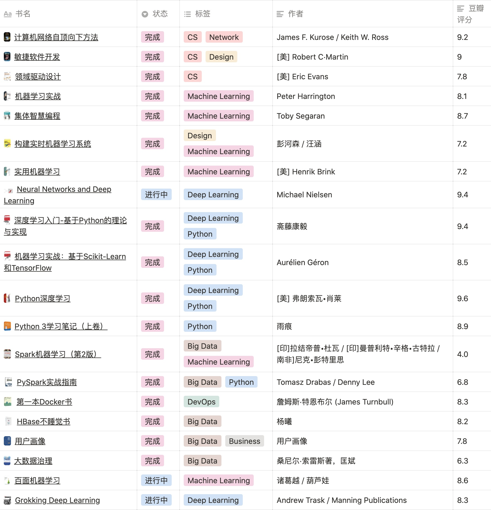

# Python 读书学习实验室

> 奇文共欣赏，疑义相与析

以前阅读完的书籍以及一些文档都没有一个保存的地方，碎片时间的学习记录就是这个库存在的目的，代码云端记录以供多端学习，相关环境如下：

- 版本：Python3.7
- 笔记本：Jupyter Lab > 3.0

## 👏 使用

为了方便实践，减少环境配置的麻烦。直接打包成了`Docker`镜像以便快速使用：

```shell
cd {your_pylab_path}
# Docker 执行
docker run --name jupyter_pylab -it -d --restart=always -p 0.0.0.0:8765:8888 -e SHELL="/bin/zsh" -v "`pwd`:/project-dir" howie6879/jupyter-lab-for-python37:v3.1.4 --allow-root --no-browser --port=8888
```

然后访问`http://0.0.0.0:8765/lab?`即可，如果没有接触过`JupyterLab`，可以参考我之前写的这篇文章[JupyterLab：程序员的笔记本神器](https://www.howie6879.cn/post/2019/04_how_to_use_jupyterlab/)。

## 🐷 我的专栏

自己总结产出的一些电子书：

| ✍️                                                            | 👨‍💻                                                      |
| :----------------------------------------------------------- | :------------------------------------------------------- |
| [Weekly](https://weekly.howie6879.cn/)：我的周刊 | [Code](https://github.com/howie6879/weekly/)            |
| [Kubernetes Note](https://www.howie6879.cn/k8s/)：Kubernetes 学习之路 | [Code](https://github.com/howie6879/k8s_note)            |
| [ML Note](https://www.howie6879.cn/ml_book/)：机器学习之路   | [Code](https://github.com/howie6879/ml_note)             |
| [Sanic-For-Pythoneer](https://www.howie6879.cn/sanic_book/)：一份sanic使用教程 | [Code](https://github.com/howie6879/Sanic-For-Pythoneer) |

## 🐼 项目

调剂工作生活的一些小项目，按照时间顺序：
- [owllook](https://github.com/howie6879/owllook)：小说搜索引擎
- [Ruia](https://github.com/howie6879/ruia)：异步爬虫框架
- [mlhub123](https://github.com/howie6879/mlhub123)：机器学习资源收集
- [2c](https://github.com/howie6879/2c)：构建一个多源（公众号、RSS）、干净、个性化的阅读环境
- [weekly](https://github.com/howie6879/weekly)：老胡的信息周刊，为您带来各种值得收藏的软件项目以及资料网站

## 🐒 笔记

学习实践记录：
- [play_with_linear_algebra](./pylab/lessons/play_with_linear_algebra)：波波老师程序员线性代数学习笔记
- [pytorch](./pylab/tutorial/pytorch/): pytorch的一些操作使用记录
- [numpy](./pylab/tutorial/numpy/): numpy的一些操作使用记录
- [python_tricks](./pylab/tutorial/python_tricks): 一些Python小技巧 
- ...

## 🐶 文章

学习过程中产出的一些文章：
- [Python](https://www.howie6879.cn/categories/python/):
    - [浅谈Python项目开发&管理](https://www.howie6879.cn/post/2021/14_about_python_env/)
    - [如何用PEP 8编写优雅的Python代码](https://www.howie6879.cn/post/2018/41/)
    - [谈对Python爬虫的理解](https://www.howie6879.cn/post/2019/02_talk_about_python_spider/)
    - [如何实现一个Python爬虫框架](https://www.howie6879.cn/post/2019/03_how_to_build_a_web_scraping_framework_with_python/)
- ML&DL
    - [ML](https://www.howie6879.cn/tags/%E6%9C%BA%E5%99%A8%E5%AD%A6%E4%B9%A0/)
    - [DL](https://www.howie6879.cn/tags/%E7%A5%9E%E7%BB%8F%E7%BD%91%E7%BB%9C%E4%B8%8E%E6%B7%B1%E5%BA%A6%E5%AD%A6%E4%B9%A0/)
- [个人思考](https://www.howie6879.cn/tags/%E6%80%9D%E8%80%83/):
    - [程序员如何在工作中保持进步](https://www.howie6879.cn/post/2019/13_how_programmers_keep_progressing_at_work/)
    - [程序员如何提升个人的技术影响力](https://www.howie6879.cn/post/2020/01_how_programmers_improve_personal_influence/)

## 📚 书籍

> 书籍是人类进步的阶梯，每次阅读都是一次对自由的探索。

此处记录比较有印象的编程相关的书籍，`Notion`地址见[这里](https://www.notion.so/0245c7cf27394c9fb92712c89ff8b64b?v=6ec8e598d9da451f993349f0f240f21f)，图示如下：

<h1 align=center>

</h1>

## 👀 关于

如果你对`Python`感兴趣，欢迎你加入我的**免费**知识星球**我的Python世界**：

<div align=center></div>

持续学习，努力就好：

- 博客：https://www.howie6879.cn
- 公众号：[老胡的储物柜](https://camo.githubusercontent.com/8f6ae80175e0224eb1fb77f4ba66e857bf594cc5/68747470733a2f2f7773312e73696e61696d672e636e2f6c617267652f303037693358435567793166796a766d777a6f71326a333070303064776d7a6c2e6a7067)，扫一扫关注我~

<div align=center></div>

