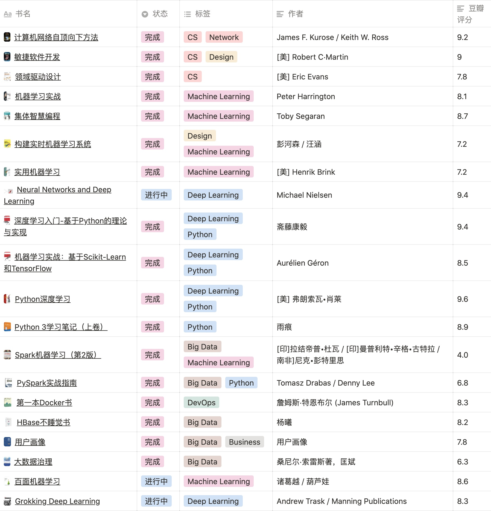

## Python 读书学习实验室

> 本项目只专注于学习、学习以及学习

以前阅读完的书籍以及一些文档都没有一个保存的地方，碎片时间的学习记录就是这个库存在的目的，代码云端记录以供多端学习：

- 版本：Python3.6
- 环境管理：pipenv
- 笔记本：Jupyter Lab
- 管理软件：Notion

### 使用

先看这篇文章[JupyterLab：程序员的笔记本神器](JupyterLab：程序员的笔记本神器)，本篇主要是针对`Jupyter Lab`插件的一些配置。

首先开启插件安装`Tab`，点击`Settings->Advanced Settings Editor`，将`false`改成`true`:

```json
{
    "enabled": false
}
```

此时可通过GUI界面进行插件安装（看你心情装不装）：

- jupyterlab-drawio
- jupyterlab_code_formatter

关于的安装配置，需要进入项目特定环境：

```shell
jupyter labextension install @ryantam626/jupyterlab_code_formatter
pipenv install jupyterlab_code_formatter
pipenv install black
jupyter serverextension enable --py jupyterlab_code_formatter
```

### 书籍

> 书籍是人类进步的阶梯，每次阅读都是一次对自由的探索。

#### 技术书籍

此处记录比较有印象的编程相关的书籍，`Notion`地址见[这里](https://www.notion.so/0245c7cf27394c9fb92712c89ff8b64b?v=6ec8e598d9da451f993349f0f240f21f)，图示如下：

<h1 align=center>

</h1>

#### 概率论与数理统计

- 统计学漫话
- 高等统计学
- 统计思想综述
- 非参数统计
- 概率论基础
	- [概率论与数理统计 厦门大学](http://www.icourse163.org/course/XMU-1003699004#/info)
	- [数理统计学简史](https://book.douban.com/subject/1522839/)
	- [概率导论](https://book.douban.com/subject/4175522/)
	- [概率论基础教程](https://www.ituring.com.cn/book/202)
- 高等数理统计学
- 多元统计分析

### 课程

> 每节课都很精彩，做好笔记。

关于课程，主要分为两大部分，分别为文字（专栏）和视频，此处同样采用`Notion`进行管理，地址分别见：

- [视频管理](https://www.notion.so/howie6879/12035133f6904f18b41a66c49acf41f7?v=704e565470fc49bca65e7e4fc8fd5abe)
- [专栏管理](https://www.notion.so/howie6879/3338c80cb631484389a17409b4ca3307?v=f5d34db10e344f85907282442d72c79a)

### 翻译

> 好的文章以及文档翻译

- 文章翻译目录: 见[Articles On Translation](.articles/articles_translation.md)

### 关于

如果你对`Python`感兴趣，欢迎你加入我的**免费**知识星球**我的Python世界**：

<div align=center></div>

持续学习，努力就好：

- 博客：https://www.howie6879.cn
- 公众号：[老胡的储物柜](https://camo.githubusercontent.com/8f6ae80175e0224eb1fb77f4ba66e857bf594cc5/68747470733a2f2f7773312e73696e61696d672e636e2f6c617267652f303037693358435567793166796a766d777a6f71326a333070303064776d7a6c2e6a7067)，扫一扫关注我~

<div align=center></div>

